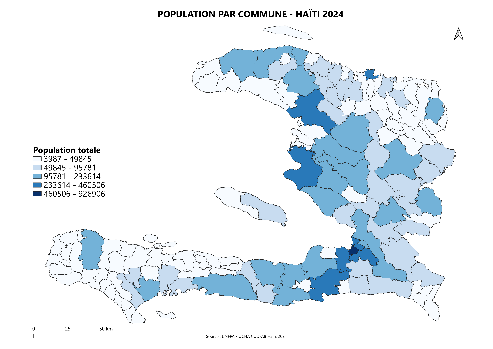
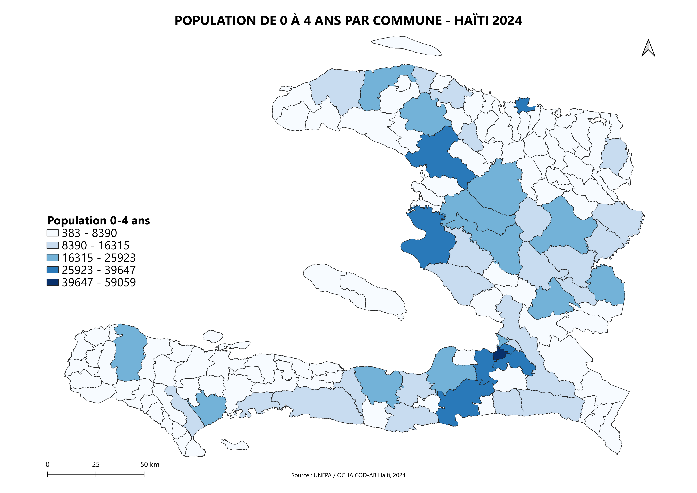
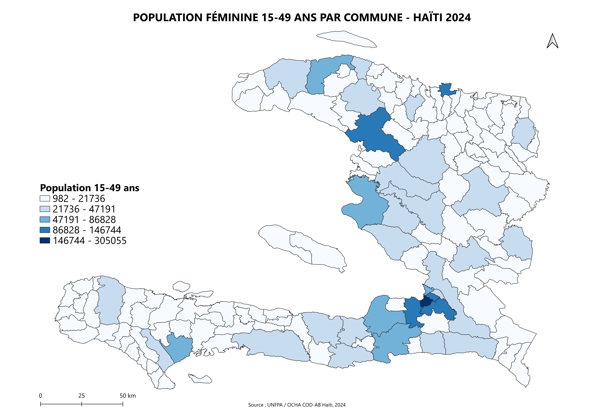
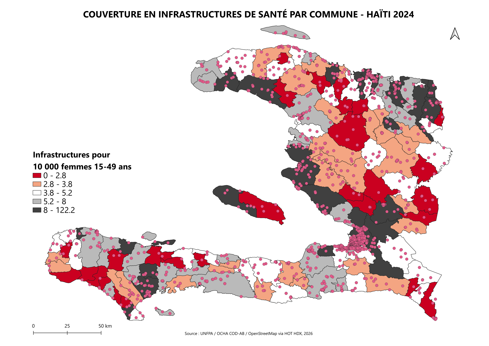
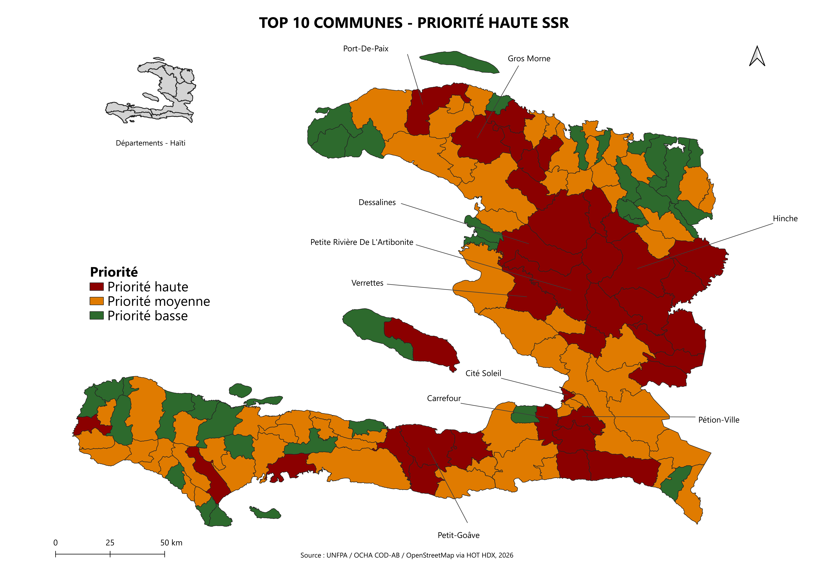

# Analyse géospatiale SSR / Haïti 2024

# Geospatial Analysis for Sexual and Reproductive Health / Haiti 2024

---

## Français

### Contexte

Santé Commune Initiative (SCI), ONG fictive spécialisée en santé reproductive, devait cibler des communes haïtiennes pour un nouveau programme de santé sexuelle et reproductive (SSR). Sans analyse géographique, ce type de décision peut reposer sur des critères incomplets ou arbitraires.

Ce projet produit une base cartographique pour la phase **Design** d’un programme humanitaire : identifier où se concentre la population cible, et quelles communes cumulent à la fois une forte demande potentielle et une faible couverture en infrastructures de santé.

---

### Données

| Source | Dataset | Fichier | Lien HDX | Niveau |
|--------|---------|---------|----------|--------|
| OCHA COD-AB | Haiti Administrative Boundaries | `hti_admin_boundaries_adm2.shp` | [HDX - COD-AB Haiti](https://data.humdata.org/dataset/cod-ab-hti) | Admin 2, 140 communes |
| OCHA COD-AB | Haiti Administrative Boundaries | `hti_admin_boundaries_adm1.shp` | [HDX - COD-AB Haiti](https://data.humdata.org/dataset/cod-ab-hti) | Admin 1, 10 départements |
| UNFPA | Haiti Population Statistics 2024 | `hti_admpop_adm2_2024.csv` | [HDX - COD-PS Haiti](https://data.humdata.org/dataset/cod-ps-hti) | Population par sexe et tranche d’âge |
| HOT OSM | Haiti Health Facilities | `health_facilities_points.shp` | [HDX - HOTOSM Haiti Health Facilities](https://data.humdata.org/dataset/hotosm_hti_health_facilities) | 2 073 points, snapshot mai 2026 |

---

### Méthodologie

Les données de population UNFPA ont été jointes aux limites communales OCHA sur le champ `ADM2_PCODE`.

#### Pourquoi utiliser la population féminine 15-49 ans ?

La population féminine âgée de 15 à 49 ans est utilisée comme proxy de la population cible principale pour un programme de santé sexuelle et reproductive (SSR). Cette tranche d’âge correspond à la définition démographique couramment utilisée pour les femmes en âge de procréer dans les analyses de santé publique, de santé maternelle et de planification familiale.

Ce choix permet d’estimer, à l’échelle communale, où se concentre la demande potentielle en services SSR : contraception, soins prénatals, accouchement sécurisé, soins postnatals, prévention des grossesses non désirées et autres services liés à la santé reproductive.

Il s’agit toutefois d’un proxy programmatique. Un programme SSR complet peut aussi cibler d’autres groupes, notamment les adolescentes de moins de 15 ans, les hommes, les jeunes, les survivantes de violences basées sur le genre ou d’autres populations vulnérables. Faute de données plus fines et harmonisées à l’échelle communale, la population féminine 15-49 ans est retenue comme indicateur principal de demande potentielle.

La population féminine de 15 à 49 ans a été retenue comme indicateur principal de demande potentielle en services SSR. Cette variable n’existe pas comme colonne agrégée dans le dataset source. Elle a donc été calculée dans QGIS avec le **Field Calculator**, en additionnant les sept tranches quinquennales de `F_15_19` à `F_45_49`.

Le ratio de couverture a ensuite été calculé après un comptage des infrastructures de santé par commune avec l’outil **Count Points in Polygon**.

Le ratio utilisé est :

```text
Nombre d'infrastructures de santé pour 10 000 femmes âgées de 15 à 49 ans
```

Formule :

```qgis
("nb_facilities" / "F_15_49") * 10000
```

Les seuils de priorisation s’appuient sur les médianes nationales :

| Indicateur | Seuil |
|-----------|-------|
| Population féminine 15-49 ans | `F_15_49 > 11 902` |
| Couverture en infrastructures | `ratio_infra < 4.54` |

La règle de priorisation est la suivante :

```qgis
CASE
WHEN "F_15_49" > 11902 AND "ratio_infra" < 4.54 THEN 'Priorité haute'
WHEN "F_15_49" > 11902 OR "ratio_infra" < 4.54 THEN 'Priorité moyenne'
ELSE 'Priorité basse'
END
```

Résultat :

| Niveau de priorité | Nombre de communes |
|--------------------|-------------------:|
| Priorité haute | 38 |
| Priorité moyenne | 64 |
| Priorité basse | 38 |

---

### Cartes produites

#### 1. Population totale par commune

Vue démographique générale. Les zones urbaines, notamment Port-au-Prince et Cap-Haïtien, concentrent les classes de population les plus élevées.



---

#### 2. Population de 0 à 4 ans par commune

Indicateur secondaire de charge maternelle et infantile par commune.



---

#### 3. Population féminine de 15 à 49 ans par commune

Population cible directe du programme SSR. Cette variable a été calculée en sommant les sept tranches quinquennales féminines de 15 à 49 ans.



---

#### 4. Infrastructures de santé et couverture par commune

Les points HOT OSM sont superposés à une choroplèthe représentant le ratio d’infrastructures pour 10 000 femmes âgées de 15 à 49 ans. Les communes les plus foncées correspondent aux niveaux de couverture les plus faibles.



---

#### 5. Communes prioritaires pour un programme SSR

Cette carte croise les deux critères de priorisation : forte population cible et faible couverture en infrastructures. Les 10 communes les plus critiques sont identifiées par des étiquettes et des lignes d’appel.



---

### Carte finale complète

Une version PDF de la carte finale est disponible ici :

[Carte finale complète SSR Haïti 2024](output/carte_finale_complete_SSR_haiti_2024.pdf)

---

### Top 10 communes en priorité haute

Seuils : `F_15_49 > 11 902` ET `ratio_infra < 4.54`.

Communes triées par population féminine 15-49 décroissante.

| Commune | Département | Population F 15-49 | Infra / 10 000 femmes |
|---------|-------------|-------------------:|----------------------:|
| Carrefour | Ouest | 146 744 | 3.95 |
| Pétion-Ville | Ouest | 120 159 | 4.33 |
| Cité Soleil | Ouest | 86 828 | 4.26 |
| Port-de-Paix | Nord-Ouest | 62 937 | 3.18 |
| Dessalines | Artibonite | 47 191 | 3.39 |
| Petit-Goâve | Ouest | 46 232 | 4.33 |
| Hinche | Centre | 43 101 | 3.48 |
| Petite Rivière de l'Artibonite | Artibonite | 42 901 | 3.26 |
| Gros Morne | Artibonite | 40 625 | 3.45 |
| Verrettes | Artibonite | 38 984 | 3.59 |

---

### Principaux résultats

L’analyse identifie **38 communes en priorité haute** pour un programme SSR. Ces communes combinent une population féminine 15-49 ans supérieure à la médiane nationale et un ratio d’infrastructures de santé inférieur à la médiane nationale.

Les communes prioritaires ne se concentrent pas dans une seule zone du pays. Elles concernent notamment l’Ouest, l’Artibonite, le Centre et le Nord-Ouest. Cette répartition plaide pour une stratégie de ciblage multi-départementale plutôt qu’un programme limité à une seule région.

L’Artibonite apparaît particulièrement importante dans le top 10, avec plusieurs communes présentant à la fois une population cible élevée et une couverture inférieure au seuil national.

---

### Limites

Le dataset HOT OSM inclut des catégories hétérogènes : hôpitaux, cliniques, pharmacies, dentistes et autres structures de santé. Toutes ne sont pas nécessairement pertinentes pour un programme SSR ciblé.

La complétude des données OSM varie selon les zones. Les zones rurales peuvent être sous-documentées par rapport aux zones urbaines.

Les chiffres UNFPA 2024 sont des projections démographiques et non des données de recensement. Le dernier recensement haïtien date de 2003.

Cette analyse doit donc être considérée comme une base d’aide à la décision, à compléter par une validation terrain et des données programmatiques plus fines.

---

### Outils utilisés

- QGIS 3.x
- Field Calculator
- Count Points in Polygon
- Natural Breaks / Jenks classification
- Données humanitaires ouvertes via HDX
- Sources : UNFPA, OCHA COD-AB, HOT OSM

---

## English

### Context

Santé Commune Initiative (SCI), a fictional NGO focused on reproductive health, needed to identify Haitian communes for a new sexual and reproductive health program. Without geographic analysis, this type of decision can rely on incomplete or arbitrary criteria.

This project builds a cartographic base for the **Design** phase of a humanitarian program: identifying where the target population is concentrated and which communes combine high potential demand with weak health infrastructure coverage.

---

### Data

| Source | Dataset | File | HDX Link | Level |
|--------|---------|------|----------|-------|
| OCHA COD-AB | Haiti Administrative Boundaries | `hti_admin_boundaries_adm2.shp` | [HDX - COD-AB Haiti](https://data.humdata.org/dataset/cod-ab-hti) | Admin 2, 140 communes |
| OCHA COD-AB | Haiti Administrative Boundaries | `hti_admin_boundaries_adm1.shp` | [HDX - COD-AB Haiti](https://data.humdata.org/dataset/cod-ab-hti) | Admin 1, 10 departments |
| UNFPA | Haiti Population Statistics 2024 | `hti_admpop_adm2_2024.csv` | [HDX - COD-PS Haiti](https://data.humdata.org/dataset/cod-ps-hti) | Population by sex and age group |
| HOT OSM | Haiti Health Facilities | `health_facilities_points.shp` | [HDX - HOTOSM Haiti Health Facilities](https://data.humdata.org/dataset/hotosm_hti_health_facilities) | 2,073 facility points, May 2026 snapshot |

---

### Methodology

UNFPA population data was joined to OCHA commune boundaries using `ADM2_PCODE`. 

#### Why use the female population aged 15-49?
The female population aged 15-49 is used as a proxy for the main target population of a sexual and reproductive health (SRH) program. This age group corresponds to the demographic definition commonly used for women of reproductive age in public health, maternal health and family planning analysis.

This choice helps estimate, at commune level, where potential demand for SRH services is concentrated, including contraception, antenatal care, safe delivery, postnatal care, prevention of unintended pregnancies and other reproductive health services.

However, this is a programmatic proxy. A comprehensive SRH program may also target other groups, including adolescent girls under 15, men, youth, survivors of gender-based violence and other vulnerable populations. In the absence of more detailed and harmonized commune-level data, the female population aged 15-49 is used as the main indicator of potential demand.

The female population aged 15-49 does not exist as an aggregated column in the source dataset. It was calculated in QGIS using the Field Calculator, by summing seven five-year female age bands from F_15_19 to F_45_49.

The health infrastructure coverage ratio was calculated after a point-in-polygon count using Count Points in Polygon.

The ratio used is:

```text
Number of health facilities per 10,000 women aged 15-49
```

Formula:

```qgis
("nb_facilities" / "F_15_49") * 10000
```

Prioritization thresholds use national medians:

Indicator | Threshold |
|-----------|-------|
|Female population aged 15-49 | `F_15_49 > 11,902`|
|Health infrastructure coverage | `ratio_infra < 4.54`|

Prioritization rule:

```qgis

CASE
WHEN "F_15_49" > 11902 AND "ratio_infra" < 4.54 THEN 'Priorité haute'
WHEN "F_15_49" > 11902 OR "ratio_infra" < 4.54 THEN 'Priorité moyenne'
ELSE 'Priorité basse'
END
```

Result:

|Priority level | Number of communes|
|--------------------|-------------------:|
|High priority | 38 |
|Medium priority | 64 |
|Low priority | 38 |

---

### Maps

Five maps were produced:

1. Total population by commune
2. Population aged 0-4 by commune
3. Female population aged 15-49 by commune
4. Health infrastructure coverage by commune
5. Final prioritization map for an SRH program

---

### Key findings

The analysis identifies **38 high-priority communes** for an SRH program. These communes combine a female 15-49 population above the national median with health infrastructure coverage below the national median.

The high-priority communes are not concentrated in a single area. They span multiple departments, including Ouest, Artibonite, Centre and Nord-Ouest. This suggests that a multi-department targeting strategy may be more appropriate than a single-region intervention.

Artibonite is especially visible in the top 10, with several communes combining large target populations and low coverage ratios.

---

### Limitations

The HOT OSM dataset includes heterogeneous facility categories, including hospitals, clinics, pharmacies and dentists. Not all of these are equally relevant for a targeted SRH program.

OSM completeness varies across communes. Rural areas may be less documented than urban areas.

UNFPA 2024 figures are demographic projections, not census data. Haiti’s last census was conducted in 2003.

This analysis should therefore be treated as a decision-support product and complemented with field validation and more detailed programmatic data.

---

### Tools

- QGIS 3.x
- Field Calculator
- Count Points in Polygon
- Natural Breaks / Jenks classification
- Open humanitarian data via HDX
- Sources: UNFPA, OCHA COD-AB, HOT OSM

---

## Workflow QGIS

### 1. Charger les données

#### Couche géographique

`Layer` > `Add Layer` > `Add Vector Layer` > `hti_admin_boundaries_adm2.shp`

#### Données population

`Layer` > `Add Layer` > `Add Delimited Text Layer` > `hti_admpop_adm2_2024.csv`

Paramètres :

- File Format : CSV
- Geometry Definition : **No geometry**

---

### 2. Jointure attributaire

Clic droit sur la couche des communes > `Properties` > `Joins` > `+`

| Paramètre | Valeur |
|-----------|--------|
| Join layer | `hti_admpop_adm2_2024` |
| Join field | `ADM2_PCODE` |
| Target field | `ADM2_PCODE` |

Vérification : ouvrir la table attributaire. Les colonnes de population doivent apparaître à droite.

---

### 3. Cartes population totale et 0-4 ans

`Properties` > `Symbology` > `Graduated` > mode `Natural Breaks (Jenks)` > 5 classes > `Classify`

Variables :

- Population totale : `hti_admpop_adm2_2024_T_TL`
- Population 0-4 ans : `hti_admpop_adm2_2024_T_00_04`

> Toujours cliquer sur `Classify` après un changement de variable. Sinon, QGIS conserve les anciens seuils de classification.

---

### 4. Calcul de la population féminine 15-49 ans

La colonne `F_15_49` n’existe pas dans le CSV source.

Il est recommandé d’exporter d’abord la couche jointe en GeoPackage :

Clic droit > `Export` > `Save Features As` > format GeoPackage > `haiti_adm2_working.gpkg`

Puis utiliser le **Field Calculator** :

- Create a new field : oui
- Output field name : `F_15_49`
- Output field type : `Decimal number (real)`

Expression :

```qgis
"hti_admpop_adm2_2024_F_15_19" +
"hti_admpop_adm2_2024_F_20_24" +
"hti_admpop_adm2_2024_F_25_29" +
"hti_admpop_adm2_2024_F_30_34" +
"hti_admpop_adm2_2024_F_35_39" +
"hti_admpop_adm2_2024_F_40_44" +
"hti_admpop_adm2_2024_F_45_49"
```

---

### 5. Charger les infrastructures de santé

`Layer` > `Add Layer` > `Add Vector Layer` > `health_facilities_points.shp`

Symbologie recommandée :

- Points rouges
- Taille : 3 à 4 px

---

### 6. Count Points in Polygon

`Vector` > `Analysis Tools` > `Count Points in Polygon`

| Paramètre | Valeur |
|-----------|--------|
| Polygons | `haiti_adm2_working` |
| Points | `health_facilities_points` |
| Count field name | `nb_facilities` |

Une nouvelle couche temporaire est créée. Il est recommandé de l’exporter en GeoPackage avant de poursuivre.

---

### 7. Calcul du ratio de couverture

Field Calculator :

- Output field name : `ratio_infra`
- Output field type : `Decimal number (real)`

Expression :

```qgis
("nb_facilities" / "F_15_49") * 10000
```

Ce ratio représente le nombre d’infrastructures de santé pour 10 000 femmes âgées de 15 à 49 ans.

---

### 8. Calcul de la colonne de priorisation

Statistiques utilisées :

| Variable | Médiane |
|----------|--------:|
| `F_15_49` | 11 902 |
| `ratio_infra` | 4.54 |

Field Calculator :

- Output field name : `priorite`
- Output field type : `Text (string)`
- Length : 20

Expression :

```qgis
CASE
WHEN "F_15_49" > 11902 AND "ratio_infra" < 4.54 THEN 'Priorité haute'
WHEN "F_15_49" > 11902 OR "ratio_infra" < 4.54 THEN 'Priorité moyenne'
ELSE 'Priorité basse'
END
```

Interprétation :

- **Priorité haute** : forte population cible ET faible couverture
- **Priorité moyenne** : une seule condition défavorable
- **Priorité basse** : aucune condition défavorable

Résultat : 38 communes en priorité haute, 64 en priorité moyenne et 38 en priorité basse.

---

### 9. Carte de priorisation finale

Symbologie :

`Properties` > `Symbology` > `Categorized` > Value : `priorite` > `Classify`

| Catégorie | Couleur |
|-----------|---------|
| Priorité haute | `#8B0000` |
| Priorité moyenne | `#E07B00` |
| Priorité basse | `#2D6A2D` |

Labels top 10 :

`Properties` > `Labels` > `Single Labels` > Value : `ADM2_FR`

Dans `Rendering` > `Show label` :

```qgis
"ADM2_FR" IN (
  'Port-de-Paix',
  'Pétion-Ville',
  'Verrettes',
  'Petit-Goâve',
  'Dessalines',
  'Hinche',
  'Gros Morne',
  'Carrefour',
  'Petite Rivière de l''Artibonite',
  'Cité Soleil'
)
```

> Dans une expression QGIS, l’apostrophe de `l'Artibonite` doit être échappée avec une double apostrophe : `l''Artibonite`.

Leader lines :

`Properties` > `Labels` > `Callouts` > `Draw callouts` > Style : `Simple lines`

Pour déplacer les labels manuellement :

`View` > `Toolbars` > `Label Toolbar` > `Move a Label or Diagram`

---

### 10. Mise en page

`Project` > `New Print Layout`

Éléments recommandés :

- Carte principale
- Inset Admin 1 / départements
- Titre
- Légende en mode manuel
- Échelle en kilomètres
- Flèche Nord
- Source des données

Exports :

- PNG 300 dpi : `Layout` > `Export as Image`
- PDF vectoriel : `Layout` > `Export as PDF`

---

## Structure du projet

```text
geospatial-ssr-haiti-2024/
├── README.md
├── cartes/
│   ├── carte_population_communes_haiti_2024.png
│   ├── carte_pop_0_4ans_communes_haiti_2024.png
│   ├── carte_pop_femmes_15_49_communes_haiti_2024.png
│   ├── carte_prioritisation_SSR_haiti_2024.png
│   ├── carte_priorisation_finale_SSR_haiti_2024.png
│   └── tableau_top10_priorite_haute_SSR_haiti.png
├── outputs/
    ├── communes_prioritaires_top10.csv
│   └── carte_finale_complete_SSR_haiti_2024.pdf
└── data/
    └── README_data.md
```

---

## Note sur les données

Les fichiers de données brutes ne sont pas inclus dans ce dépôt afin de limiter la taille du projet et de respecter les bonnes pratiques de reproductibilité.

Les sources utilisées sont documentées dans `data/README_data.md` et peuvent être téléchargées depuis HDX :

- OCHA COD-AB Haiti : <https://data.humdata.org/dataset/cod-ab-hti>
- UNFPA Haiti Population Statistics : <https://data.humdata.org/dataset/cod-ps-hti>
- HOT OSM Haiti Health Facilities : <https://data.humdata.org/dataset/hotosm_hti_health_facilities>

---

## Citation des sources

Données administratives : OCHA COD-AB Haiti.  
Données de population : UNFPA Haiti Population Statistics 2024.  
Données d’infrastructures de santé : HOT OSM Haiti Health Facilities, snapshot mai 2026.  
Traitement et cartographie : QGIS 3.x.

---

## Licence et usage

Ce projet est un exercice de portfolio réalisé à des fins d’apprentissage et de démonstration de compétences en analyse géospatiale appliquée au MEL et à la planification de programmes humanitaires.

Les données sources restent soumises aux conditions d’utilisation de leurs fournisseurs respectifs : OCHA, UNFPA, HOT OSM et HDX.

---

*Projet réalisé dans le cadre du développement de compétences en analyse géospatiale appliquée au MEL et à la planification de programmes humanitaires.*

*Project developed as part of a skills-building effort in geospatial analysis for MEL and humanitarian program design.*